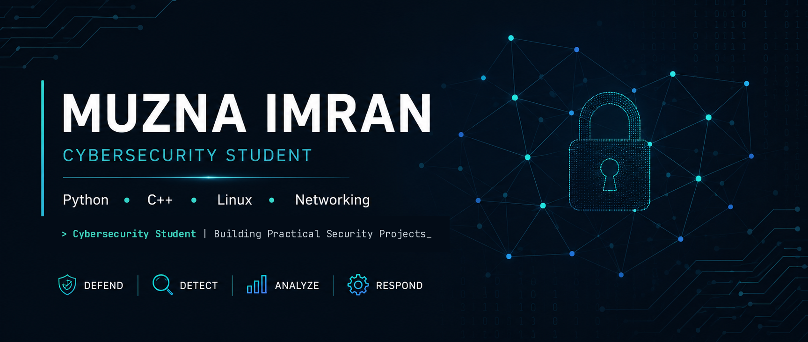

  

# Hi, I'm Muzna Imran 👋

🎓 BS Cybersecurity Student | Aspiring SOC Analyst

I'm a cybersecurity student with an interest in defensive security, networking, and security automation. I enjoy solving technical challenges, building practical projects, and continuously expanding my knowledge through hands-on learning.

---

## 👩‍💻 About Me

- 🎓 Bachelor of Science in Cybersecurity
- 💼 Cybersecurity Intern at OGDCL
- 🔒 Interested in Security Operations (SOC), Network Security, and Incident Response
- 🐍 Building cybersecurity projects with Python
- 🌱 Currently learning through TryHackMe and hands-on labs

---

## 🛠️ Technical Skills

### Programming Languages
- Python
- C++
- SQL

### Operating Systems
- Linux
- Kali Linux
- Windows

### Networking
- TCP/IP
- DNS
- HTTP/HTTPS
- Network Fundamentals

### Cybersecurity
- Wireshark
- Nmap
- Git & GitHub
- Linux Security Fundamentals

---

## 📜 Certifications

- Cisco – Introduction to Cybersecurity
- Forage – Mastercard Cybersecurity Job Simulation
- Forage – Deloitte Australia Cyber Job Simulation
- HackerRank – Python
- SkillFront – ISO/IEC 27001 Information Security Associate™
- Red Team Leaders – Certified Cybersecurity Educator Professional (CCEP)

---

## 📖 Currently Learning

- TryHackMe – Pre Security
- Python for Cybersecurity
- SOC Fundamentals
- Security Automation

---

## 🚀 About This GitHub

This GitHub showcases the projects and tools I build while developing my cybersecurity skills. My focus is on creating practical applications that strengthen my understanding of networking, automation, and defensive security.

---

## 📫 Connect With Me

- LinkedIn: www.linkedin.com/in/muzna-imran
- GitHub: https://github.com/MuznaImran
