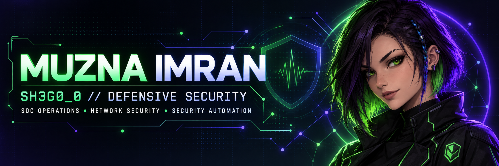

# Hi, I'm Muzna Imran

**Final-year BS Cybersecurity student at Air University (expected June 2027), focused on SOC operations, network security, and practical defensive tooling.**

I combine hands-on SOC and NOC internship experience with security projects that turn concepts into clear, testable workflows. I am especially interested in blue-team operations, SIEM monitoring, network defense, and Python security automation.

I publish my cybersecurity work under the operator handle **SH3G0_0**.

[LinkedIn](https://www.linkedin.com/in/muzna-imran) · [Email](mailto:muznaimran328@gmail.com) · Islamabad, Pakistan

## Featured projects

### [Python Security Assessment Toolkit](https://github.com/MuznaImran/python-security-assessment-toolkit)

A defensive Python command-line toolkit for password hygiene, authorized TCP checks, SHA-256 integrity monitoring, SSH authentication-log triage, IOC enrichment, and JSON/CSV/TXT reporting.

- Guided, fully offline project demo
- 46 automated tests and GitHub Actions validation on Python 3.11 and 3.13
- Secure defaults, bounded network checks, synthetic samples, and documented limitations

[Run the guided demo](https://github.com/MuznaImran/python-security-assessment-toolkit#run-the-guided-demo)

### [CivicFlow Service Request Tracker](https://github.com/MuznaImran/civicflow-service-request-tracker)

A full-stack resident and administrator workflow for submitting, assigning, resolving, auditing, and reporting community service requests.

- React 19, TypeScript, Next.js route handlers, Cloudflare D1, and Drizzle ORM
- Authenticated administrator workflow with signed sessions and CSRF protection
- Operational dashboards, audit history, filters, and CSV exports

[Open the live demo](https://civicflow-request-tracker.muznaimran328.chatgpt.site/)

### [Wazuh SIEM and SOC Lab](https://github.com/MuznaImran/wazuh)

A reproducible, sanitized security-monitoring portfolio based on skills developed during my six-week OGDCL cybersecurity internship. It includes Wazuh configuration and custom-rule examples, synthetic Windows telemetry, authentication and FIM labs, SOC playbooks, compliance mapping, automated tests, and CI validation.

## Experience

### SOC Analyst Intern — OGDCL | Jul–Aug 2026

- Completed a six-week rotation split between SOC analysis and network security.
- Reviewed security logs and alert severity under supervision in a SOC/SIEM environment.
- Studied network-security controls and connected defensive concepts to practical investigation workflows.

### NOC Intern — Engro Enfrashare | Aug–Sep 2026

- Supported telecom-site monitoring, alarm verification, and coordination with field teams.
- Contributed to requirements documentation and communication with developers for a planned internal website.
- Helped prepare an operational schedule for the NOC department.

## Technical focus

- **Security operations:** Wazuh, SIEM fundamentals, log analysis, alert triage, MITRE ATT&CK, incident-response fundamentals
- **Network security:** TCP/IP, DNS, DHCP, VLANs, ACLs, NAT, VPNs, firewalls, Nmap, Wireshark
- **Development:** Python, SQL, Bash, PowerShell, JavaScript, TypeScript, React, Git, GitHub
- **Assessment and governance:** OWASP Top 10, NIST Cybersecurity Framework, ISO/IEC 27001, risk assessment, IAM fundamentals

## CTF highlights

- **1st place** — ByteBolt CTF (Fall 2023), achieved during my first semester
- **Team Fatal Flaw — 41st overall and highest-ranked Pakistani team** — Black Hat MEA Qualification CTF (2026)
- **Team Z3R0S — 20th overall** — Black Hat MEA Qualification CTF (2025)

## Current work

- Developing **BreachSim**, a final-year phishing-simulation and security-awareness platform.
- Expanding hands-on skills in SOC investigation, security automation, and defensive engineering.
- Open to graduate and junior opportunities in SOC, blue-team, and network-security roles.

## Selected certifications and training

- **TryHackMe — Pre Security Learning Path (2026)** · Top 9% on TryHackMe
- Cisco — Introduction to Cybersecurity (2026)
- SkillFront — ISO/IEC 27001 Information Security Associate (2026)
- Mastercard — Cybersecurity Job Simulation on Forage (2026)
- Deloitte Australia — Cyber Job Simulation on Forage (2026)
- HackerRank — Python (Basic) (2026)
